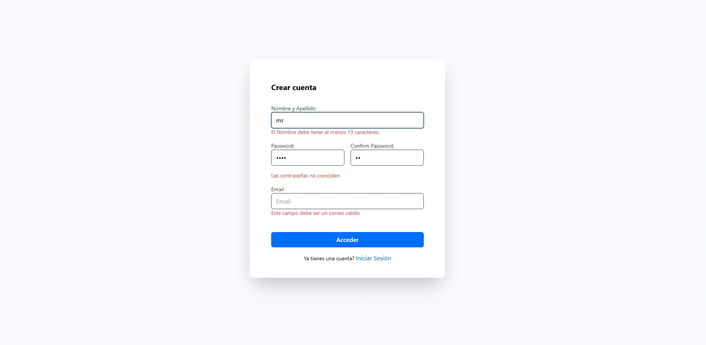

Prueba técnica realizada con Angular + NodeJs y ExpressJs + PostgreSQL.

Utilice Postman para testear las APIs y WeatherApi para tarea del clima.

Para esta prueba realice tanto el Frontend como el Backend solicitado, primeramente maquetando lo que fue el frontend el cual decidí utilizar Tailwind para los estilos. Realice los puntos que se ponían a prueba, primeramente el template de Login, el Register y el Dashboard junto con la api que se menciona en el enunciado de la prueba con weatherApi para su dicha finalidad y un crud de Tareas, en el ultimo paso que fue mostrar los usuarios registrados junto con sus datos, remarcando los puntos importantes que tuvimos que haber registrado la fecha inicio login y su logout.

Yendo a lo técnico muestro la estructura de las tablas realizada con PostgreSQL

CREATE TABLE tasks (
id SERIAL PRIMARY KEY,
titulo TEXT NOT NULL,
completada BOOLEAN DEFAULT false
);

CREATE TABLE users (
id SERIAL PRIMARY KEY,
nameLast VARCHAR(100) NOT NULL,
email VARCHAR(100) UNIQUE NOT NULL,
password TEXT NOT NULL,
ultimo_login TIMESTAMP,
ultimo_logout TIMESTAMP
);

Template Login y Register
Utilice Formularios reactivos para hacer dicha peticiones POST tanto para Registrarme y Login el user. Protegiendo las rutas en caso de que el usuario quiera acceder a rutas ajenas.

Template Dashboard
Cree el aside bar para tener una navegacion entre las rutas tanto de weather api como la de usuarios,
para traer me ayude con el documento swagger que me trae los datos, apartir de la api con los detalles ("/current.json") necesarios para realizar todo lo necesario para este ejercicio.

Use a modo de ejemplo el componente de Tareas para su reutilizacion, donde hice un toggle en el caso de que la tarea
este Completa o no, tambien podemos agregar una o eliminar alguna de ellas.

Template Usuarios
Realice las peticiones GET para obtener los datos de todos los usuarios a partir de que ingresaron sus datos a la hora de
registrarse, capture tanto la fecha de registro como tambien la de su ultimo inicio de sesion(cuando se le da a logout se registra). Utilice formularios reactivos para la busqueda filtrada decide utilizar exhaustMap uno de los operadores de RxJS junto con un debounce para no spamear la red de solicitudes, podria haber utilizado switchMap que emisiones anteriores pero para formularios me parece mejor el uso de exhaustMap.

En el backend separe responsabilidades, implemente los controller.js tanto para el sistema de login donde manejo, obtener los usuarios, hacer login, registrarme y obtener la fecha del ultimo login y la estructura para las tasks crear, obtener o borrar alguna tarea. Conexion a la base de datos de Postgre para traer la estructa de las tabla gestionada con pool de pg.
Para las rutas HTTP las dividi en auth.routes.js y task.routes.js, siguiendo el patron REST, estas rutas se usan en el app.js para una mejor organizacion.
Permitiendo solicitudes desde el frontend hacia el backend mediante el uso de CORS.

Como levantar los servidores:
Para el backend Node + Express

cd backend
npm install
npm run dev

Para el frontend

cd frontend
npm install
ng serve

